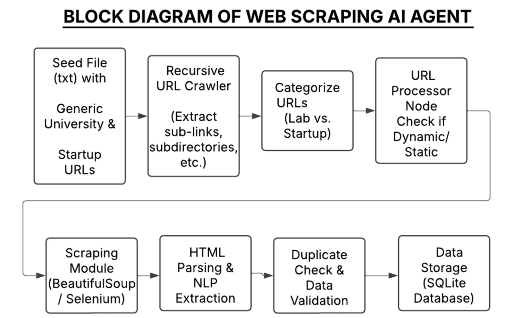
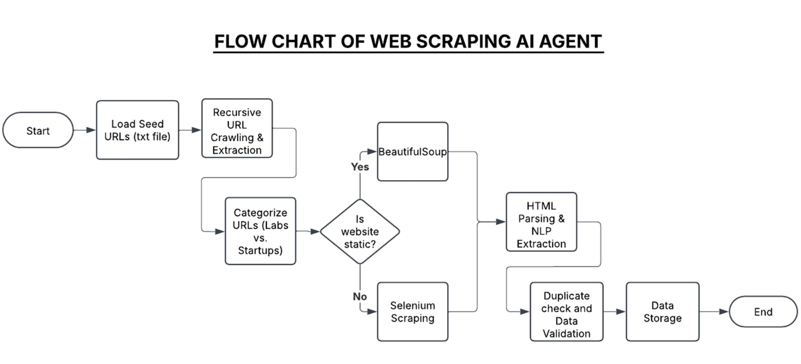
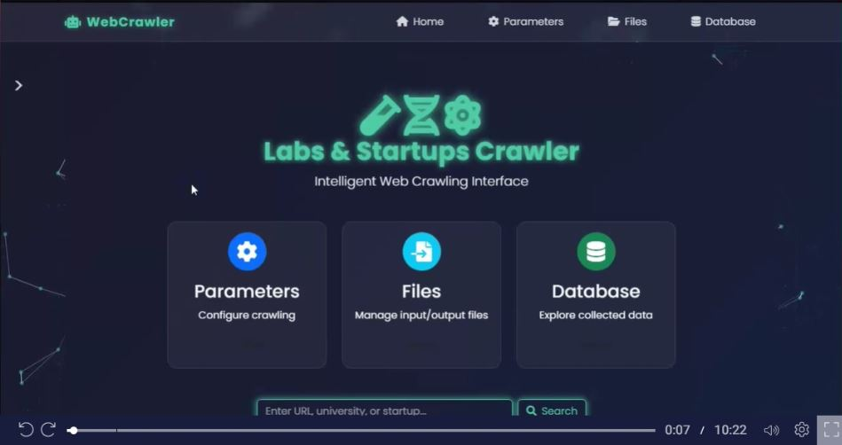

# Web Crawler AI Agent with Django

## Overview

The **Web Crawler AI Agent** is a Django-based application designed to intelligently crawl, scrape, and extract structured data from web pages, with a focus on academic and research-oriented websites. Leveraging **AI and Machine Learning** (ML), the system uses an online learning model to prioritize relevant URLs, employs Large Language Models (LLMs) for data extraction, and integrates both static (BeautifulSoup) and dynamic (Selenium) scraping techniques. The extracted data is stored in a SQLite database (`labs_startups.db`) and is accessible via a user-friendly interface that includes a search bar for initiating crawls with specific URLs.

This project is ideal for researchers, data scientists, and organizations looking to gather structured insights from web-based research content, such as university labs, publications, and equipment details. The AI-driven approach ensures efficient crawling by learning from past interactions and improving URL selection over time.

## Features

- **AI-Powered URL Selection**: Uses an `OnlineLearningCrawler` model to predict and prioritize relevant URLs based on anchor text and parent relevance.
- **Hybrid Scraping**: Combines `BeautifulSoup` for static content and `Selenium` for dynamic, JavaScript-rendered pages.
- **LLM Data Extraction**: Utilizes a Large Language Model to extract structured data (e.g., university details, publications, research abstracts) from scraped content.
- **Database Integration**: Stores extracted data in a SQLite database (`labs_startups.db`) for persistence and querying.
- **User Interface**: Includes a search bar for users to input URLs and initiate crawls, built with Django templates and static files.
- **Logging and Error Handling**: Comprehensive logging (`crawler.log`) to track the crawling process and handle errors gracefully.
- **Extensible Workflow**: Powered by `LangGraph` for a modular, state-based workflow that manages the crawling, scraping, extraction, and storage processes.

## Folder Structure

```
Web_Crawler_AI_Agent_Django/
├── Airlectric/              # Django project settings and configuration
├── crawler/                # Core crawling logic and workflow
├── data/                   # Data processing utilities
├── labs_startups/          # Django app for managing lab/startup data
├── logs/                   # Log files (crawler.log)
├── models/                 # ML model files (online_model.pkl, scaler.pkl)
├── staticfiles/            # Static assets (CSS, JS, images)
├── utils/                  # Helper functions for scraping, extraction, and database operations
├── .gitignore              # Git ignore file
├── build.sh                # Build script for setting up the project
├── crawler.log             # Log file for crawler activity
├── labs_startups.db        # SQLite database for storing extracted data
├── manage.py               # Django management script
├── query.txt               # File for storing user queries or seed URLs
├── requirements.txt        # Python dependencies
```

## Installation

1. **Clone the Repository**:

   ```bash
   git clone https://github.com/Airlectric/Web_Crawler_AI_Agent_Django.git
   cd Web_Crawler_AI_Agent_Django
   ```

2. **Set Up a Virtual Environment**:

   ```bash
   python -m venv venv
   source venv/bin/activate  # On Windows: venv\Scripts\activate
   ```

3. **Install Dependencies**:

   ```bash
   pip install -r requirements.txt
   ```

4. **Set Up the Database**:
   Run Django migrations to initialize the SQLite database:

   ```bash
   python manage.py migrate
   ```

5. **Run the Application**:
   Start the Django development server:

   ```bash
   python manage.py runserver
   ```

6. **Access the Application**:
   Open a browser and navigate to `http://localhost:8000` to use the search bar and initiate crawls.

## Usage

1. **Input URLs**: Use the search bar in the web interface to submit URLs for crawling.
2. **Crawling Process**:
   - The system initializes with seed URLs (from `query.txt` or user input).
   - The `OnlineLearningCrawler` evaluates URLs for relevance using ML.
   - Static or dynamic scraping is performed based on URL type.
   - Extracted data is processed by an LLM and stored in `labs_startups.db`.
3. **View Results**: Access the extracted data via the Django interface or query the database directly.
4. **Monitor Logs**: Check `crawler.log` for detailed logs of the crawling process.

## AI and Machine Learning Components

- **OnlineLearningCrawler**: A custom ML model (`online_model.pkl`, `scaler.pkl`) that learns from URL relevance scores and updates itself with each crawl. It uses features like anchor text and parent relevance to prioritize URLs.
- **LLM Extraction**: A Large Language Model processes scraped content to extract structured information, such as:
  - University details (name, location, website)
  - Department information (name, focus, team members)
  - Publications (Google Scholar URLs, other sources)
  - Research abstracts and lab equipment details
- **Dynamic Adaptation**: The model updates its predictions based on the success of extractions, ensuring continuous improvement in URL selection.

## Images

The project includes static assets in the `static/` directory, such as:

- **Workflow Diagram**:
  
  A Block diagram of how the system works

- **Workflow Diagram**:
  
  A diagram illustrating the LangGraph-based workflow (initialize → check URLs → detect type → scrape → extract → store → update model).

- **Screenshots**:
  
  Visuals of the Django interface, including the search bar and results page.

## Video Demo

For a detailed walkthrough of how the Web Crawler AI Agent works, including the AI-driven crawling process and data extraction, watch our demo video:

[Watch the Demo Video](https://go.screenpal.com/watch/cThnF6nQrSr)

## Contributing

Contributions are welcome! To contribute:

1. Fork the repository.
2. Create a new branch (`git checkout -b feature/your-feature`).
3. Make your changes and commit (`git commit -m "Add your feature"`).
4. Push to the branch (`git push origin feature/your-feature`).
5. Open a pull request.

Please ensure your code follows the project's coding standards and includes appropriate tests.

## License

This project is licensed under the MIT License. See the `LICENSE` file for details.

## Contact

For questions or support, contact the project maintainer at [agudeydaniel8@gmail.com](mailto:agudeydaniel8@gmail.com).
